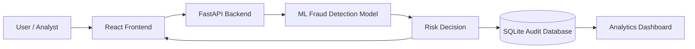

# RazorGuard AI

AI-powered payment fraud detection and risk prevention for synthetic transaction data.

## Problem Statement

Payment systems must make fast authorization decisions while identifying unusual behavior that may indicate fraud. Manual review is slow and inconsistent, while simple rules can miss combinations of risk signals or create unnecessary friction for legitimate customers.

## Proposed Solution

RazorGuard AI combines a trained machine-learning classifier with a FastAPI service and a React operations dashboard. Analysts can submit transaction signals, receive a risk score with an explainable decision, review the audit trail, and monitor aggregate risk activity.

## Why Fraud Detection Matters

Fraud detection helps reduce unauthorized losses, protect customer trust, and focus manual review on the transactions most likely to require intervention. A useful system must balance fraud capture with the cost of false positives that inconvenience legitimate customers.

## Key Features

- Class-weighted ExtraTrees fraud classifier with validation-selected decision threshold.
- Stratified held-out evaluation with no test-set use during model or threshold selection.
- FastAPI endpoints for health, prediction, transaction history, and analytics.
- SQLite audit trail for prediction results and risk explanations.
- React and Vite operations dashboard with risk checking, history, analytics, loading states, and error states.
- CORS configuration for local frontend-to-backend development.

## Machine Learning Pipeline

1. Load the existing synthetic transaction dataset from `ml/data/transactions.csv`.
2. Exclude `transaction_id` and the `fraud` target from model features.
3. One-hot encode `transaction_type` and pass numeric signals through the scikit-learn pipeline.
4. Split the data into 80% training and 20% stratified held-out testing data.
5. Use an inner validation split from the training partition to select the decision threshold. The test partition remains unseen during this selection.
6. Train a class-weighted ExtraTrees classifier on the complete non-test training partition.
7. Save the complete preprocessing pipeline and decision threshold to `ml/models/fraud_model.pkl`.
8. Evaluate once on the held-out test set.

## Dataset

The project uses a generated, synthetic dataset at `ml/data/transactions.csv` containing 12,000 transactions. It includes signals such as amount deviation, new recipients, device and location changes, failed transactions, account age, transaction timing, and transaction frequency. It contains no real payment, customer, or personally identifiable information.

## Actual ML Evaluation Results

These results are from the stratified, held-out test set of 2,400 transactions:

| Metric | Result |
| --- | ---: |
| Dataset | 12,000 transactions |
| Fraud percentage | 7.19% |
| Accuracy | 90.83% |
| Precision | 32.33% |
| Recall | 24.86% |
| F1-score | 28.10% |
| False positives | 90 |
| False negatives | 130 |

Confusion matrix, ordered as genuine then fraudulent: `[[2137, 90], [130, 43]]`.

These are prototype results on synthetic/demo data. They are not production Razorpay metrics and must not be interpreted as a performance guarantee for a real payment provider or live customer traffic.

## Technology Stack

- **Frontend:** React, Vite, Lucide React, responsive CSS.
- **Backend:** Python, FastAPI, Pydantic, Uvicorn.
- **ML:** Python, Pandas, NumPy, scikit-learn, ExtraTrees.
- **Persistence:** SQLite.
- **Testing:** Pytest, FastAPI TestClient, live browser smoke testing.

## System Architecture

The component-level flow is documented in [docs/architecture.md](docs/architecture.md).



## Backend API

The backend runs at `http://127.0.0.1:8000` by default.

| Method | Endpoint | Purpose |
| --- | --- | --- |
| `GET` | `/health` | Confirm service and model availability. |
| `POST` | `/predict` | Score a transaction and record the prediction audit entry. |
| `GET` | `/transactions` | Return recent prediction audit records. |
| `GET` | `/analytics` | Return risk counts and average risk score. |

`POST /predict` accepts the trained model features: `amount`, `hour`, `transaction_frequency`, `average_amount`, `recipient_is_new`, `device_changed`, `location_changed`, `transaction_type`, `account_age_days`, and `previous_failed_transactions`. The optional `transaction_id` is used for audit identification and is not sent to the model.

## Frontend Features

- Dashboard with transaction totals, flagged decisions, high-risk count, average score, and risk distribution.
- Analyze Transaction view with the exact backend feature form and live model result.
- Risk result panel with score, Safe/Suspicious/High Risk level, reasons, and recommended action.
- Transaction History table backed by `GET /transactions`.
- Analytics view backed by `GET /analytics`.
- Responsive navigation, loading states, empty states, and API error messaging.

## Transaction Prediction Flow

1. An analyst enters transaction signals in the React form.
2. React sends the typed and converted values as JSON to `POST /predict`.
3. FastAPI validates the payload with Pydantic.
4. The backend loads the existing serialized pipeline and applies the same feature order and preprocessing used during training.
5. The model returns a fraud probability; the backend maps it to a risk score, risk level, reasons, and recommended action.
6. The response is rendered in the React risk result panel.
7. The full prediction is saved to SQLite and becomes available through transaction history and analytics.

## Local Setup

Run commands from the repository root. Use separate terminals for the backend and frontend.

### Backend

```powershell
.venv\Scripts\python.exe -m pip install -r backend\requirements.txt
.venv\Scripts\python.exe -m uvicorn backend.main:app --reload
```

The backend stores local audit data in `backend/database/razorguard.db`.

### Frontend

```powershell
Set-Location frontend
npm install
npm run dev -- --host 127.0.0.1 --port 5173
```

The frontend uses `VITE_API_URL` when provided and otherwise connects to `http://127.0.0.1:8000`.

### Validation

```powershell
npm --prefix frontend run build
.venv\Scripts\python.exe -m pytest tests\test_backend.py -q
```

## Security and Defensive Use

RazorGuard AI is a defensive fraud-detection prototype intended for authorized development and demonstration use. Do not submit real payment or customer data. Do not place credentials, API keys, access tokens, or other secrets in the repository or frontend bundle.

## Limitations

- The dataset is synthetic and cannot represent the full diversity of real fraud patterns.
- The prototype has no production identity, authorization, rate limiting, or case-management workflow.
- A single held-out split does not measure performance across time, merchants, geographies, or payment providers.
- The risk threshold is a prototype operating point and requires business-cost analysis before deployment.
- SQLite is suitable for this local prototype, not high-volume production transaction processing.
- Explanations are feature-signal summaries, not causal explanations of customer behavior.

## Future Improvements

- Validate on representative, authorized, privacy-preserving production-like data.
- Add time-based and cross-validation evaluation with monitoring for drift.
- Calibrate probabilities and tune thresholds against explicit fraud and review costs.
- Add authentication, authorization, rate limiting, structured logging, and operational alerting.
- Move audit storage to a managed database with retention and access controls.
- Expand review workflows and model feedback loops with human analyst outcomes.

## Project Structure

```text
backend/    FastAPI service, model integration, schemas, and SQLite audit storage
frontend/   React + Vite risk operations dashboard
ml/         Dataset, training/evaluation scripts, and serialized model
tests/      Backend endpoint tests
docs/       Architecture and project documentation
```