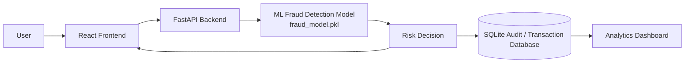

# RazorGuard AI Architecture

RazorGuard AI connects a React operations interface to a FastAPI prediction service. The backend applies the existing serialized ML pipeline, persists each decision to SQLite, and serves the same audit data to the history and analytics views.

## Request Flow

1. The user submits transaction features from the React Analyze Transaction view.
2. The frontend sends the JSON payload to `POST /predict`.
3. FastAPI validates the request and sends the features through the same preprocessing pipeline used during model training.
4. The model returns a fraud probability. The backend creates a risk score, risk level, explanation reasons, and recommended action.
5. The prediction response is displayed in React and the complete audit record is written to SQLite.
6. React refreshes `GET /transactions` and `GET /analytics` so the history and dashboard reflect the new decision.

## Main Interfaces

- `GET /health`: service and model availability.
- `POST /predict`: model-backed transaction prediction and audit write.
- `GET /transactions`: recent stored prediction records.
- `GET /analytics`: aggregate risk counts and average risk score.